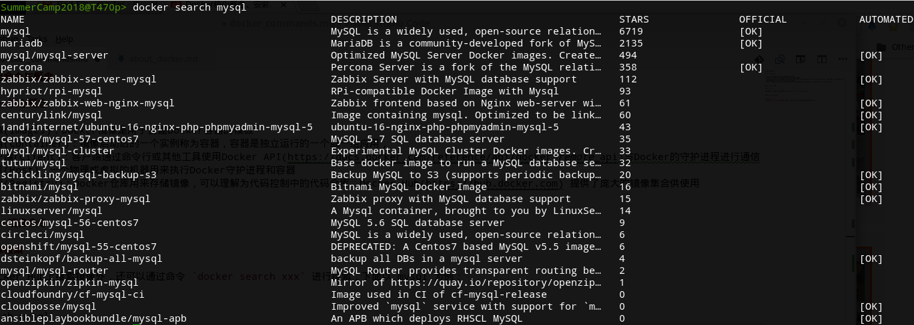
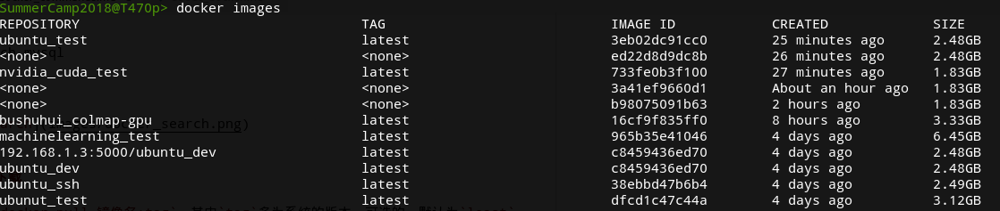
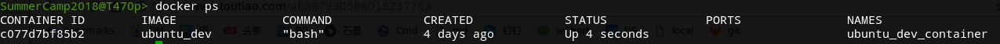

# docker常用命令与概念

## 1. Docker核心概念

* docker镜像(Images)：Docker镜像是用于创建Docker容器的模板
* docker容器(Container)：镜像启动后的一个实例称为容器，容器是独立运行的一个或一组应用，
* docker客户端(Client)：客户端通过命令行或其他工具使用Docker API(https://docs.docker.com/reference/api/docker_remote_api)与Docker的守护进程进行通信
* docker主机(Host)：一个物理或虚拟的机器用来执行Docker守护进程和容器
* docker仓库(Registry)：Docker仓库用来存储镜像，可以理解为代码控制中的代码仓库，Docker Hub(https://hub.docker.com) 提供了庞大的镜像集合供使用


## 2. Docker镜像命令

### 2.1 镜像检索

除了可以在Docker Hub上搜索镜像外，还可以通过命令 `docker search xxx` 进行搜索，下面以 mysql 为例：

```
docker search mysql
```

结果是：



### 2.2 镜像下载

下载命名为：`docker pull 镜像名:tag`，其中`tag`多为系统的版本，可选的，默认为`least`。

例如：
```
docker pull mysql
```

### 2.3 镜像列表
获取已下载镜像列表命令：`docker images`

```
docker images
```

结果是：


其中：
* RESPOSITORY为镜像名
* TAG为镜像版本，least代表最新版
* IMAGE_ID为该镜像唯一ID
* CREATED为该镜像创建时间
* SIZE为该镜像大小


### 2.4 镜像删除

删除指定镜像：`docker rmi image-id`，其中`image-id`是镜像的id，也可以是镜像的名字

例如
```
docker rmi ubuntu_test
```

删除所有镜像（**危险**）：
```
docker rmi $(docker images -q)
```


## 3. 容器操作

### 3.1 查看运行中容器
可通过如下命令，查看运行中的容器列表：`docker ps`

结果如下：


其中：
* CONTAINER ID：启动时生成的ID
* IMAGE：该容器使用的镜像
* COMMAND：容器启动时执行的命令
* CREATED：容器创建时间
* STATUS：当前容器状态
* PORTS：当前容器所使用的默认端口号
* NAMES：启动时给容器设置的名称

### 3.2 停止运行中的容器

通过以下命令来停止运行中的容器：
```
docker stop container-id/[container-name]
```

其中`container-name`是容器的名字，`container-id`是容器id，**两者输入一个即可**


### 3.3 查看所有的容器

通过以下命令可查看运行和停止的所有容器：
```
docker ps -a
```

### 3.4 启动容器

（1） 通过以下命令启动容器（之前退出的）：
```
docker start container-id/[container-name]
```

（2） 如何将终端连接到docker容器
```
docker attach container-id/[container-name]
```
这样就可以进入到docker的控制台。


（3） 如何在容器中执行一个命令
```
docker exec -it container-id/[container-name] bash
```
其中的`-it`是交互的方式执行，`bash`是需要执行的命令

（4） 如何退出？

退出命令为：
```
exit
```
或者可以输入`Ctrl+d`退出。


### 3.5 如何提交容器到镜像
**一般容器里做的改变是不会保存到镜像的**，因此如果想把做过的改变保存，需要将容器提交到镜像文件

```
docker commit container-id/[container-name] image-name
```
其中
* `container-id` 是容器的ID
* `container-name` 是容器的名字
* `image-name` 是镜像的名字


### 3.6 删除容器

删除单个容器：
```
docker rm container-id
```

删除所有容器：
```
docker rm $(docker ps -a -q )
```

### 3.7 启动做端口映射的容器

**Docker运行容器之后却发现没IP，没端口，也就是说，启动容器的时候如果不指定对应参数，在容器外部是无法通过网络来访问容器内的网络应用和服务的。 所以需要通过Docker端口映射来实现网络访问。**

Docker的端口映射通过-p参数实现，命令如下：
```
docker run --name tomcat2 -d -p 8888:8080 tomcat
```
如上，就把主机端口8888请求映射到Docker容器内部端口8080了。

端口映射格式：

`ip:hostport:containerport`: 指定ip、指定主机port、指定容器port
`ip::containerport`: 指定ip、未指定主机port、指定容器port
`hostport:container`: 未指定ip port、指定主机port、指定容器port


### 3.8 查看容器日志

查看当前容器日志，可通过如下命令：
```
docker logs container-id/container-name
```

### 3.9 查看端口映射

可以通过如下命令查看容器映射了哪些端口及协议：
```
docker port container-id
```

示例：
```
[root@docker ~]#docker port 46114af6b44e
8080/tcp -> 0.0.0.0:8888

[root@docker ~]#docker port cea668ee4db0
```
如果返回空，则代表没进行端口映射。


## 参考资料
* [Docker核心概念、安装、端口映射及常用操作命令](https://www.toutiao.com/a6587930586013237763)
